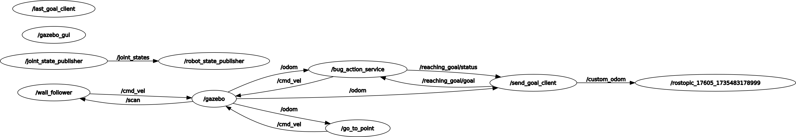

# **Research Track Assignment 2**

* this is a forked version that implements an action_client that send goals to the action server and is able to cancel them through a simple GUI


<br/>
---

## Project Structure




## **OverView**

### **Nodes**
1. Send_goal_node 
- this node is a simple action_client that can send goals and cancel them to the action_server 
- implements a simple tkinter GUI for better ability to cancel and send goals while still seeing the feedback of the Target sent in the terminal
- subscribes to the /odom and takes `x`,`y`,`xVel`,`yVel` and publishes them to a custom message topic calles `"/custom_odom"`

2. request_last_goal 
- this node implements a service that requests the last Target set by the user
- if the user has cancelled the last goal it would output `"Last Goal was Cancelled"`
- if the user just started the simulation it would output `"xnan ynan"`
- if the robot is going to the goal currently or has reached it it outputs `"x{float} y{flaot}"`

3. assignment1.lauch
- this launch file launches the entire simulation with each of the `send_goal_node` and `request_service_node` in their own terminal.
- it also launches a .sh file that runs `rostopic echo /custom_odom` and this terminal echos the custom msg topic getting published.


### **Adjustments to forked Repository**
1. **robot2_laser.gazebo**
- Modified the Laser sensor Plugin from `<plugin name="gazebo_ros_head_hokuyo_controller" filename="libgazebo_ros_gpu_laser.so">` to `<plugin name="gazebo_ros_lds_lfcd_controller" filename="libgazebo_ros_laser.so">` because it didn't work on my machine and outputed the wrong ranges which caused the robot to keep rotating around itself and no laser scan was visible in Rviz

## **Installation and running**
- **Dependencies:**
  - ROS Noetic
  - tkinter

- **steps:**
  - `cd <catkin_workspace>/src`
  - ```ruby
  git clone https://github.com/Melasmar-711/assignment_2_rt.git
  cd ..
  catkin_make

	```


## Simulation Output
<br/>

[](https://youtu.be/1LKGSQmxTP4)


